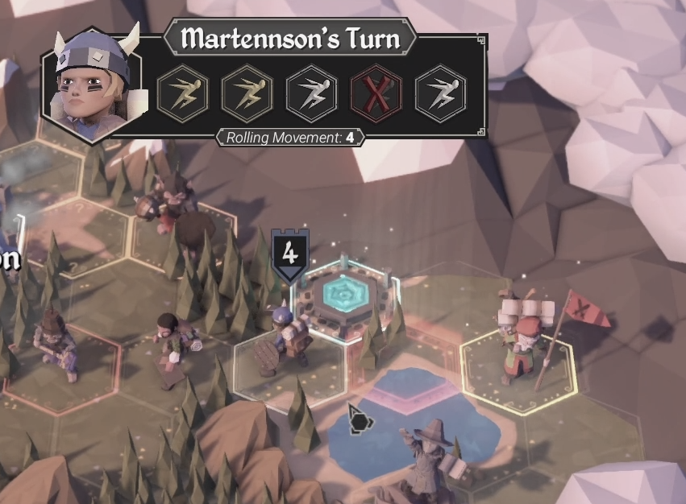
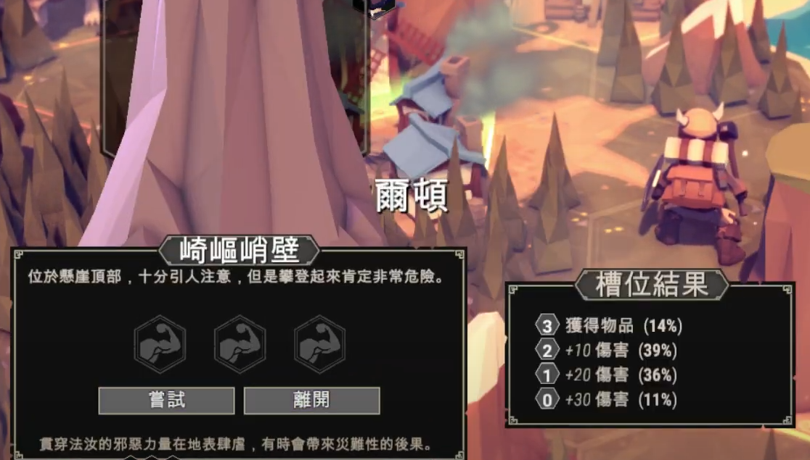
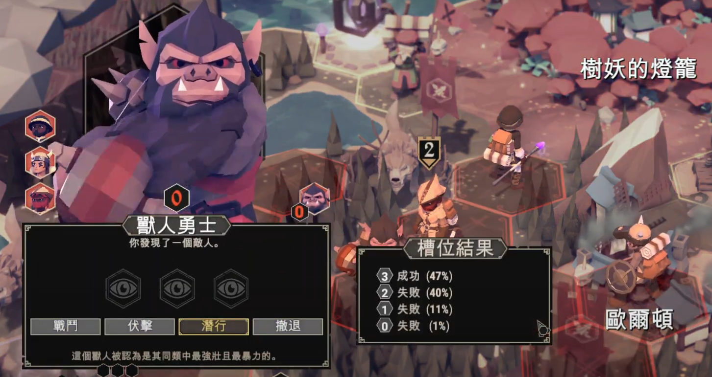
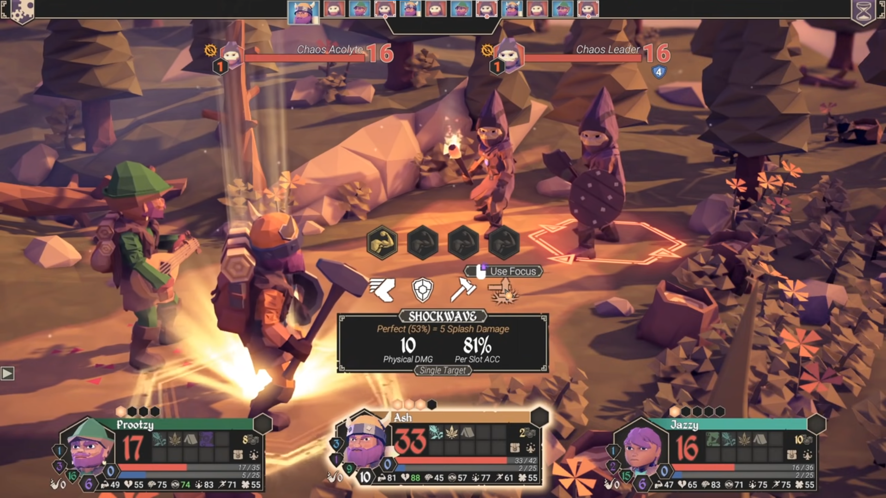
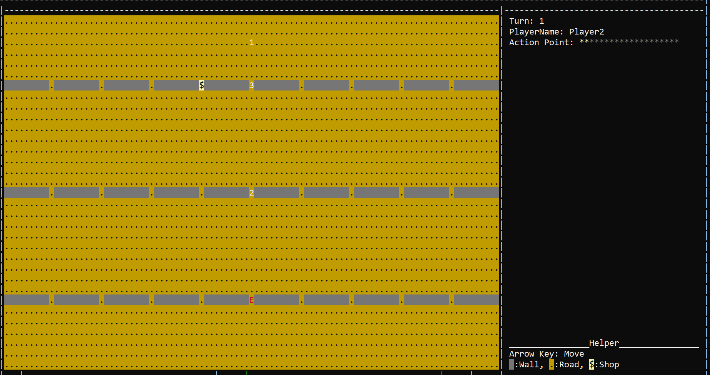

# Spec
實作參考遊戲 [For the king](https://store.steampowered.com/app/527230/For_The_King/?l=tchinese)，預期完成該遊戲的部分功能，  
功能並非與原遊戲相同，如有與遊戲不同之處，請依照此文件為準。  
UX、遊戲體驗不影響分數，UI只需能呈現評分需求即可，不會因此扣數。

## 玩法概述
玩家一共操作三名角色，透過探索地圖、戰鬥、完成任務等方式，獲得經驗、金錢、裝備等資源。    

--- 
.jpg)  
主世界示意圖  

一開始選擇3位角色進行遊戲，角色由不同的職業組成，每個職業有不同的被動技能、屬性。  
玩家會在[主世界](#主世界)地圖上探索地圖，移動、與物件互動需要消耗行動力，  
行動力會被玩家的[速度](#生物屬性)影響。  

  
示意圖: 玩家速度會影響行動力與機率  

當玩家移動到[地塊](#地塊)，若該[地塊](#地塊)有可互動物件，則會觸發[互動物件](#互動物件)，進入戰鬥、商店、隨機事件等。
  
示意圖: 隨機事件，根據隨機機率，會有不同的結果。  

當玩家遇到敵人時，會進入戰鬥模式，玩家可以選擇逃跑、戰鬥，  
觸發戰鬥的地區，根據一定的範圍，其他玩家可以支援該玩家一起進行戰鬥，  
同樣的，範圍內的敵人也會支援該敵人進行戰鬥。
選擇戰鬥時會進入[戰鬥](#戰鬥機制)模式。
  

戰鬥模式中，玩家可以選擇攻擊對象、使用技能或道具等， 
武器會有不同的技能成功率、傷害等，

---
上面圖片僅為示意，所呈現的功能並非與原遊戲相同，如有與遊戲不同之處，請依照以下文件為準。

## 規格說明
### 符號定義
- [ ] : 視實作情況決定是否實作，可以被當成加分項目
- [X] : 評分項目

### 主世界
地圖由矩形地塊構成，不能將整張地圖一次畫進整個視窗內，
使用者控制的角色會在地圖上移動，可以進行上下左右移動，地圖上會有[互動物件](#互動物件)、[敵人](#敵人)等。

- [X] 不能將整張地圖一次畫進整個視窗內
- [X] 使用者控制的角色可以在地圖上移動，不能移動到`地圖外、不可通行地塊`
- [X] 正確顯示地圖物件與互動
- [ ] 戰爭迷霧
<!-- - [ ] 縮放視窗渲染地圖的解析度 -->

### 地塊
地圖由矩形地塊拼接構成，地塊上會有[互動物件](#互動物件)、[敵人](#敵人)等，  
最少需要實作一個不可通行地塊

### 互動物件
地圖上會有互動物件，玩家移動到互動物件上，會觸發互動。  
- [X] 商店: 可以購買物品，販售所有Demo會用到的物品，需要有金錢的機制，商品價格自行定義。
- [X] [敵人](#敵人): 觸發戰鬥，可以選擇撤退或戰鬥
  - [X] 戰鬥: 進入[戰鬥模式](#戰鬥機制)
  - [X] 撤退: 回到上一個地塊
  - [ ] 伏擊，執行3次擲骰判定，若全部成功，敵人無法支援，否則敵人全體獲得Buff::加速，持續1回合。可以使用專注。  

  戰鬥支援: 以敵人為中心，Manhattan distance$\le3$的範圍內玩家與敵人會支援戰鬥，玩家數量與敵人數量皆不能超過3人。  
- [X] 隨機事件: 觸發隨機事件  
玩家擲骰，根據擲骰結果，會有不同的結果，可以使用專注力使擲骰必定成功。  
- 4次擲骰，1~4獲得 {$2*成功次數$} 的金錢，失敗則最大生命值減少10%
- 3次擲骰，1~2回復 {$5*成功次數$} 的生命值，3獲得1件裝備(自行定義)，失敗則失去10%最大生命值的生命值
<!-- - [ ] 任務: 接受任務 -->

### 金錢
所有玩家共用金錢，金錢可以在商店中購買物品。  

### 地圖移動階段
玩家移動到地圖上，會消耗行動力，行動力會被玩家的[速度](#生物屬性)影響。  
玩家行動順序為一開場決定，之後依固定順序輪流行動，  
$$ 行動力最大值 := {生物屬性::速度\over10} $$  
若出現小數，則向下取整。  
$$ 行動擲骰機率成功 := {生物屬性::速度\over100}，最大值為90\% $$  
執行擲骰次數為行動力最大值，玩家行動力擲骰成功，則行動力+1。  
擲骰成功的次數即為玩家該輪可以使用的行動力。

### 敵人
敵人屬性與玩家相同，敵人位置固定、不會移動，  
多個敵人可以在地圖塊上的同一位置，但不能超過3個，  
敵人屬性技能自行定義，可以滿足其他項目需求即可。  
敵人技能選擇隨機，攻擊目標隨機，不會使用[專注力](#生物屬性)。  

### 生物屬性
生物有以下屬性:
- 生命值
- 專注力: 使用專注可以使需要擲骰的判定必定成功，  
    根據規格會有分可以使用與不能與用的情境
- 速度: 影響每回合的行動力、行動力擲骰機率、戰鬥順序
- 命中率: 影響攻擊等擲骰成功率
- 物理攻擊力
- 物理防禦力
- 魔法攻擊力
- 魔法防禦力 

### 戰鬥機制
[Buff、Debuff](#buff--debuff)會在戰鬥結束後消失，[技能](#技能)冷卻也會重置。  

#### 行動順序
$$ 優先級 := {(玩家已行動次數+1)\over(生物屬性::速度)}*100$$  
若出現小數，則向下取整。  
得到的優先級會進行排序，優先級最低的玩家先行動，  
若優先級相同，則依序比較  
- 生物屬性速度
- 物理+魔法攻擊力和
- 物理+魔法防禦力和
- 最大生命值  

值高的玩家先行動，  
若以上皆相同，則自行定義，沒有規範。  

##### Example
假設有兩個生物，A、B，  
- A速度: 10  
- B速度: 5  
  
回合一開始，所有玩家已行動次數為0，  
第一回合決定行動順序，  
- A的優先級為$({(0+1)\over10})*100=10$
- B的優先級為$({(0+1)\over5})*100=20$  

A優先級最低，A先行動。  
第二回合決定行動順序，  
- A的優先級為$({(1+1)\over10})*100=20$，
- B的優先級為$({(0+1)\over5})*100=20$，  

A、B優先級相同，依序比較，  
A速度10，B速度5，A優先行動。  
第三回合決定行動順序，  
- A的優先級為$({(2+1)\over10})*100=30$，
- B的優先級為$({(0+1)\over5})*100=20$，
  
輪到B行動。  

--- 

#### 流程
若為玩家回合，則玩家可以選擇攻擊對象、使用技能或道具等，  
若為敵人回合，則敵人會隨機選擇攻擊對象、隨機使用技能。  
詳細流程請看[流程圖](./docs/BattleUML.drawio)

- [X] 行動順序
- [X] 正確執行戰鬥機制
- [X] 可以選擇技能使用對象
- [X] 可以使用技能
- [X] 可以使用道具  

### 技能
技能分為主動與被動技能。  

---

#### 主動技能
只能在戰鬥中使用，需要擲骰判定是否成功，  
可以使用專注力使擲骰必定成功。  
擲骰判定全部成功，稱為完美發動，某些技能會有完美發動的效果，  
擲骰判定全部失敗，稱為發動失敗，發動失敗不會使用技能且進入冷卻，某些技能會有失敗發動的效果。  
如果為傷害、回復技能等有包含數值的技能，  
下面技能說明中的數值欄位為完美發動的數值公式，  
如果非完美和非失敗，則數值跟擲骰成功次數成等比。  
$$ value = {擲骰成功次數\over擲骰總次數}*完美發動數值$$
技能說明:  
| 名稱 | 擲骰次數 | 成功率(%) | 技能傷害 | 說明 | 冷卻 | 
| --- | --- | --- | --- | --- | --- |
| 普通攻擊 | 1 | 生物屬性::命中率 | 生物屬性::物理攻擊力*100% | 共通技能，如果有裝備武器，會被武器的普通攻擊取代 | 0 |
| 逃跑 | 1 | $({{生命}\over{最大生命+物魔防禦力和}})*玩家速度$, 最大值98 | - | 共通技能，逃離戰鬥，成功後該玩家離開此戰鬥，如果所有玩家逃跑，則戰鬥結束 | 0 |
| 挑釁 | 1 | ${生命\over最大生命+物魔攻擊力和}$ | - | 成功時，給予敵人Debuff::挑釁，持續3回合 | 2 |
| Shock blast | 3 | 生物屬性::命中率 - 5 | 生物屬性::魔法攻擊力*50% | 對所有敵人造成傷害 | 1 | 
| 治療 | 2 | 生物屬性::命中率 | 生物屬性::魔法攻擊力*150% | 治療自己或隊友，回復生命值 | 1 |
<!-- | 加速 | 2 | 生物屬性::命中率 | - | 給予自己或隊友Buff::加速，持續1回合 | 3 | -->

武器的普通攻擊會取代共通技能的普通攻擊，武器的普通攻擊會使用適合的攻擊類型，其他與共通技能相同。  

---

#### 被動技能
在戰鬥中、探索地圖中、商店中等都會生效，  
| 名稱 | 觸發條件 | 冷卻回合 | 說明 |
| --- | --- | --- | --- |
| Hammer-Splash | 使用單體技能且完美發動 | 0 | 目標敵人[暈眩](#buff--debuff)1回，且其他敵人受到目標敵人實際受到傷害50%的傷害。遊戲中所有的[Hammer](#裝備)類武器，皆會有此被動 |
| Run | 每回合[行動力](#地圖移動階段)擲骰第一個保證成功 | 0 | |
| 破壞裝備 | 使用單體技能且對目標造成傷害 | 0 | 目標身上裝備隨機一件裝備被移除 |
<!-- | 單體減傷 | 被單體技能攻擊時 | 5 | 受到單體技能攻擊時，減少10%傷害 | -->

--- 

技能冷卻時間會在玩家回合開始時-1，如果為0則可以使用技能，技能初始冷卻為0。

- [X] 實作上述欄位提到的技能或類似機制
- [ ] 額外加分項目: 視實作技能的複雜度，由助教主觀判斷是否給予加分

--- 

### 傷害計算
$$ 傷害 = (技能傷害 - 防禦力), 如果傷害\le0，則傷害=1。$$  
若技能傷害和對敵人造成的傷害出現小數，則向下取整。

--- 
#### 傷害計算範例
- Hammer-Splash  
  傷害計算範例: 技能傷害為10，目標敵人防禦力為5，則傷害為$(10-5)=5$，  
              其他敵人防禦力為2，則對其他敵人造成$(5-2)*0.5=1.5$取整數$1$點傷害。

### 裝備
裝備有分三個部位，分別為武器、防具、飾品，一個部位只能裝備一個裝備，可以有部位沒有穿戴裝備。  
裝備會影響生物屬性，  
所有武器都會有一個普通攻擊且會替換掉[共通技能](#主動技能)的普通攻擊，  
傷害計算方式與普通攻擊相同，只是會用適合的攻擊力類型。  
戰鬥中，不可以更換裝備，只能在地圖探索時更換裝備。  

| 名稱 | 部位 | 效果 | 技能 | 說明 |
| --- | --- | --- | --- | --- |
| WoodenSword | 武器 | 物理攻擊力+10，普通攻擊擲骰2 | | |
| WoodenShield | 武器 | 物理防禦力+10，普通攻擊擲骰1 | 挑釁 | | 
| Plate Armor | 防具 | 物理防禦力+20 | 單體減傷 | |
| Shoes | 飾品 | 速度+5 | Run | |
| Hammer | 武器 | 物理攻擊力+20, 命中-15，普通攻擊擲骰3 | Hammer-Splash | |
| MagicWand | 武器 | 魔法攻擊力+10，普通攻擊擲骰2 | Shock blast | |

請根據其他項目需求，實作出適合的裝備，  
不用與上述欄位完全一致，只需符合需求機制即可。

- [X] 角色能正確穿戴裝備，以及套用裝備效果
- [ ] 裝備隨機品質，品質會影響裝備效果，例如: 木劍(普通)、木劍(優秀)、木劍(史詩)、木劍(傳說)，較好的裝備還能有額外技能

### 道具
道具可以在戰鬥中或者地圖探索時使用，道具使用會消耗掉該道具，  
在戰鬥中使用道具，會結束該玩家的回合，   
所有角色共用道具與金幣，道具使用後會消失。

| 名稱 | 效果 | 說明 |
| --- | --- | --- |
| Godsbeard | 回復玩家25點生命值，可以在戰鬥中使用 | |
| GoldenRoot | 回復玩家3點專注力，可以在戰鬥中使用 | |
| TeleportScroll | 瞬間移動到地圖上任意一個地塊 | |
| Tent | 放置在地圖上，如果玩家行動結束時在此地塊，可以回復50點生命值，與5點專注 | 在放置此道具的玩家下次行動時消失在地圖上 |

- [X] 道具能正確使用、消耗
- [ ] 額外加分項目: 視實作道具機制的複雜度，由助教主觀判斷是否給予加分

### Buff & Debuff
只會在戰鬥階段生效，Buff & Debuff會在戰鬥結束後消失，  
在玩家回合開始時，先執行會在此條件觸發的Buff & Debuff效果，  
之後使持續回合-1，如果為0則消失。  

| 名稱 | 效果 | 觸發時機 | 註記 |
| --- | --- | --- | --- |
| 挑釁 | 被挑釁者只能選擇攻擊挑釁者 | 行動回合且使用攻擊類型的主動技能 | |
| 暈眩 | 直接跳過該次行動 | 回合開始時 | |
| 中毒 | 每回合受到當前生命值的10%傷害 | 回合開始時 | |  
| 加速 | 角色速度提升最大值的50% | | 記得重新計算行動順序 |

若多個Buff & Debuff同時觸發，自行定義執行順序。

- [X] Buff & Debuff能正確套用與消失
- [X] 實作上述提到的Buff & Debuff類似機制
- [ ] 額外加分項目: 視實作Buff & Debuff的複雜度，由助教主觀判斷是否給予加分

## 系統加分項目
- [ ] GUI，QT等UI框架
- [ ] 讀檔，存檔
- [ ] 網路連線，多人遊戲，需要在不同的電腦或設備上進行遊戲

## 額外說明
評分不會驗證機率是否正確，如果需要出現成功或失敗的情況會在評分需求中提到。  

## 評分項目
- 主世界 (共8%)  
  - (3%) 不能將整張地圖一次畫進整個視窗內
  - (2%) 使用者控制的角色可以在地圖上移動，不能移動到`地圖外、不可通行地塊`
  - (3%) 顯示地圖物件與互動  
  
  加分:  
  - (1%) 戰爭迷霧
---
- 互動物件 (共15%)  
當玩家移動到互動物件上，會觸發互動。  
以下指互動時的功能。  
  - (4%) 商店
    - (2%) 商店物品清單: 列出可以購買的物品與價格
    - (2%) 購買物品
  - (6%) 敵人
    - (2%) 行為清單: 列出可以進行的行為
    - (2%) 進入戰鬥
    - (2%) 撤退，回到上一個地塊  

    加分:
    - (1%) 伏擊，執行3次擲骰判定，若全部成功，敵人無法支援，否則敵人全體獲得Buff::加速，持續1回合。可以使用專注。  
  - (5%) 隨機事件
---
- 戰鬥流程 (共13%)  
與敵人互動後，選擇戰鬥進入戰鬥流程。  
  - (3%) 行動順序: 每輪玩家的行動順序正確
  - (4%) 正確執行戰鬥機制: 傷害計算、正確使用專注和結束戰鬥，生物死亡後必須正確刪除  
  - (2%) 選擇技能使用對象
  - (2%) 使用技能  
    技能要進入冷卻，冷卻會在該生物回合開始時-1  
  - (2%) 使用道具  
    使用道具後玩家回合結束，並且道具消失。
- 技能 (共32%)  
  - (3%) 普通攻擊
  - (6%) 逃跑
  - (3%) 治療
  - (4%) ShockBlast
  - (6%) Hammer-Splash
  - (5%) Run
  - (5%) 破壞裝備
- 裝備 (共5%) 
  - 角色能穿戴裝備，部位不能不重複，並且正確套用裝備效果

  加分:
  - (1%) 裝備隨機品質  
    品質會影響裝備效果，  
    例如: 木劍(普通)、木劍(優秀)、木劍(史詩)、木劍(傳說)，較好的裝備還能有額外技能
- 道具 (共12%)
  效果要正確套用，並且消耗道具    
  - (2%) Godsbeard
  - (2%) GoldenRoot
  - (3%) TeleportScroll
  - (5%) Tent
- Buff & Debuff (共15%)
  - (3%) Buff & Debuff能正確套用與消失
    Buff與Debuff會在戰鬥結束後消失，  
    Buff & Debuff持續時間會在玩家回合開始時-1，如果為0則消失。  
  - (4%) 挑釁
  - (4%) 暈眩
  - (4%) 中毒
- 系統加分項目 (共7%)
  - (2%) GUI，QT等UI框架
  - (2%) 讀檔，存檔:
    必須能夠隨時保存當前遊戲狀態，必且能夠正確復原
  - (3%) 網路連線，多人遊戲，需要在不同的電腦或設備上進行遊戲

額外加分共10%

## 流程範例
[流程圖](./docs/GameUML.drawio): 範例流程圖，僅供參考，操作與流程不一定要與此相同，只要符合規格需求即可。  
[戰鬥流程圖](./docs/BattleUML.drawio)